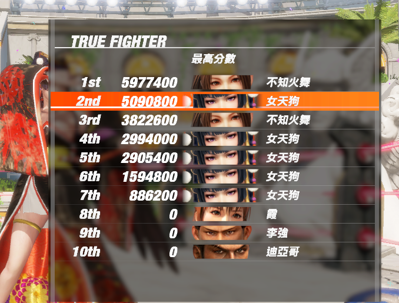
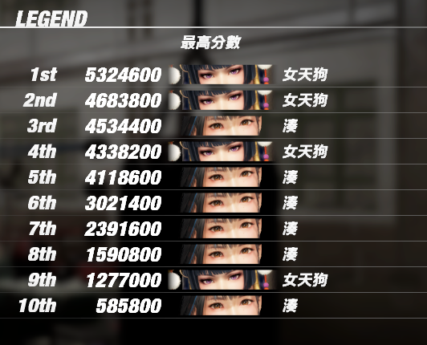

# doa6lr_ai — DOA6 Last Round 自動 Hold／反擊機器人

[English](README.md) | 繁體中文

An auto-hold / anti-CPU bot for **Dead or Alive 6 Last Round** (`DOA6LR.exe`, 64-bit, Windows).
It reads the opponent's move state straight out of game memory, picks the counter hold,
and sends keyboard input inside the startup window. Offline use only.

讀取遊戲記憶體裡對手的招式狀態（招式 ID、階段、幀數、打擊屬性、投技指令），在對手的發生幀窗內送出對應的 Hold，
投技用下段踢／蹲／後撤／側移／解投回應，並用學到的連段反擊。**只用於離線對 CPU**（Versus、訓練、連戰、街機）。

> 線上對真人開這個就是作弊。請不要。

---

## 成績



遊戲內 **True Fighter**（連戰）最高分數榜。前七名全是機器人打的：第 1、3 名用不知火舞（5,977,400／3,822,600），
第 2 名和第 4–7 名用女天狗（5,090,800 到 886,200）。第 8–10 名是沒動過的預設值。

各角色單次連戰紀錄（勝–負）：女天狗 155–2、101–0；不知火舞 83–1、62–1；Kula 83–1。
整場 Hold 命中率 85–92%，單挑常見 100%。

**在遊戲最高難度「傳說」下，回合勝率約 95%。** 最近幾次用湊打出來的成績：81–1、68–1、42–1。



**傳說**難度的連戰最高分榜，前十名全是機器人打的：女天狗第 1、2、4、9 名
（5,324,600 到 1,277,000），湊第 3、5、6、7、8、10 名（4,534,400 到 585,800）。

## 現況

- **已訓練四隻角色：女天狗（id 21）、不知火舞（id 30）、Kula Diamond（id 31）、湊（id 35）**，
  各有戳擊、連段池與對局統計。
  其他角色退回通用連段池與 P 戳擊，統計從零累積。對手方面，`startup.json` 等表只涵蓋實際遇過的 CPU 角色，
  新對手每一招要先學（沒學過的招預設防禦，每個新的攻擊性投技要被抓一次才會學到改側步）。
- 對手每一招的發生幀、投技類型、攻擊性投技（OH）、不能 Hold 的招、每個投技最好的回應和解投輸入，
  全部在對局中**自動學習並存成 JSON**，下次啟動直接沿用。
- 連段以「淨傷害 = 打出 − 被打」自動比較（多臂吃角子老虎），按自己的角色分開統計；浮空後的追擊會一直重按到浮空技收招結束。
- 受創（hit stun）中也會出 Hold：遊戲把輸入暫存到硬直結束（24001 累計 52/77）。真連段和倒地類的受創 id 會自動退休。
- 投技：普通投（CommandCode 363／400）用 T 解，95/98 與 65/66；方向投解不掉（四種輸入合計約 1/40）。
  8 幀以內的快投用 **2K** 回應：下段攻擊從第 1 幀起算蹲姿，站立投抓不到（同一招用斜下蹲只有 1/14）。
  對付快投無解的摔角手，在射程內不戳擊、先拉開距離，對手站著時用我方普通投先抓（不知火舞對 char 2 18/25）。
- 面向沒有記憶體欄位：用走路 id 探測、每次 Hold 內再確認一次，投技或倒地前後兩人位置向量反轉就翻旗標。
- 對手換人（連戰）、自己坐 P1 或 P2、遊戲設 3-way 或 4-way Hold、刻意加的輸入延遲，都會自動偵測或用旗標對應。

## 需求

- Windows 10/11，DOA6 Last Round（Steam）
- Python 3.10 以上。`holdbot.py` 只用標準函式庫（`ctypes` 讀記憶體、`SendInput` 送鍵盤）
- 掃描工具（`autoscan.py`、`probe.py`、`timeline.py`、`valuescan.py`）另外需要 `numpy`
- 可選：`pip install vgamepad`（虛擬 Xbox 手把，需要 ViGEmBus）
- 以**系統管理員**身分執行終端機（`ReadProcessMemory` 需要）

遊戲內設定：鍵盤預設鍵位（H = J、P = K、K = L、T = M；U = P+K、I = S、O = H+K）。
訓練模式的 Hold 設定要跟 `--hold-mode` 一致。

## 快速開始

```powershell
git clone https://github.com/yuchinchenTW/doa6lr_ai.git
cd doa6lr_ai
python fields.py                      # 確認位址表還有效（應該印出雙方血量等欄位）
python holdbot.py --dry-run           # 只判斷、只印，不送輸入
python holdbot.py --hold-mode 4way    # 真的打（遊戲設 4-way 時）
python holdbot.py                     # 預設 3-way
```

啟動後先進對局（或訓練模式），程式會自己找座標列、確認自己是 P1 還是 P2，然後開始。`Ctrl-C` 結束並印統計。

## 常用旗標

| 旗標 | 預設 | 說明 |
|---|---|---|
| `--hold-mode 3way\|4way` | `3way` | 要跟遊戲設定一致；3-way 時中腳也用 4H |
| `--me auto\|P1\|P2` | `auto` | 自動偵測鍵盤控制的是哪一邊 |
| `--window N` | 16 | 對手剩幾幀進判定時出 Hold |
| `--poke ...` | `auto` | 對手閒置時的戳擊，依角色自動選（女天狗 P+K、不知火舞 4P、Kula 6P） |
| `--combo ...` | `auto` | 打中後的連段；`auto` 用角色連段池自動比較 |
| `--no-hold-in-stun` | 關 | 預設在 hit stun 中也出 Hold |
| `--no-break-blow` | 關 | 預設 Break Gauge 滿時用 6S Break Blow 反擊 |
| `--break-hold` | 關 | 開啟 4S Break Hold |
| `--throw-answer crouch\|jab\|none` | `crouch` | 投技的基本回應；每個投技再自動學最好的（快投從 2K 開始） |
| `--close-throw-range N` | 75 | 在無解快投的射程內，對手站著且距離在 N 以內就先出我方普通投（0 關閉） |
| `--unknown guard\|skip\|hold` | `guard` | 沒學過發生幀的招怎麼處理 |
| `--dry-run` / `--probe` | | 不送輸入 / 只看偵測與學 startup |

完整清單：`python holdbot.py --help`。

## 它學什麼、存在哪

| 檔案 | 鍵 | 內容 |
|---|---|---|
| `startup.json` | 對手角色 + 招式 | 判定開始幀（看到 Phase 0→1 那一幀記下） |
| `throws.json` | 對手角色 + 招式 | 投技的 CommandCode、上中下段、起手距離 |
| `throw_answers.json` | 對手角色 + 招式 | 下段踢／蹲／後撤／側移／防禦各自的成功次數；失敗兩次自動換 |
| `throw_escapes.json` | 投技的 CommandCode（跨角色共用） | 解投輸入（T／6T／4T／2T）各自的成功次數 |
| `close_throw.json` | 自己角色:對手角色 | 對手站著、距離 75 內時我方先出普通投的成功次數；低於 30% 停用 |
| `oh.json` | 對手角色 | 攻擊性投技（會抓 Hold 的招） |
| `nohold.json` | 對手角色 | Hold 接到卻 0 傷害的招，改用防禦 |
| `stun_holds.json` | 我方受創動畫 id | 在該硬直中出 Hold 的成敗；0/3、10 次後低於 15%、或倒地動畫就退休 |
| `combo_stats.json` | 自己的角色 + 起手招 | 每條連段的次數與淨傷害 |
| `commands.json` | 我方輸入 | 每個鍵盤輸入產生的 CommandCode 與招式 id（`comboreplay.py --calibrate`），以及重播學到的碼 |
| `pos.json` | | 角色物件內座標欄位的偏移 |
| `layout.json` | | 記憶體位址表（靜態指標鏈 + 欄位偏移） |

自己換角色不會影響對手相關的學習；對手相關的表按對手角色 id 分開。

## 輸出怎麼讀

`#n` Hold、`~` 投技回應（`ours:` 是我方招式 ID 序列）、`*` 戳擊、`+` 連段、`=` 防禦、`>` 對助跑出手、
`<` 起身後撤、`^` 倒地起身、`T` 先投對方、`v` 靠牆蹲躲快投、`!` 學到新東西或被抓、`(skip)` 看到但當下不能動、
`THROWN` 被投前 20 個狀態變化。結尾統計有各類命中率、被誰打掉多少血、當時剛做了什麼、連段排名、解投表、回合勝負。

## 連段挑戰（實驗中）

`comboreplay.py` 在連段挑戰模式裡讀遊戲自己的示範：示範每一個輸入都會以 CommandCode 變化出現在記憶體，
連同產生的招式和與前一個輸入的間隔，然後照樣重播（F8），每個任務前先走到示範當時的距離。
不認識的碼會依候選清單逐個試，打出示範的招式後記進 `commands.json`。`--calibrate` 把每個鍵盤輸入按一次、
印出各自的碼和招式；`--probe-cmd N` 找出某個碼的按法（「←→ P+K」就是這樣確認為 cmd 5780）。
單招關卡能過，多任務的關卡目前能做到 19 個輸入中的 11 個，需要特定距離變體招式的任務還沒解。

## 遊戲更新之後

改版會搬動執行檔裡的靜態資料，`layout.json` 裡每條指標鏈的**起點**就失效了，
機器人什麼都找不到：

```
anchors did not resolve: {'state': None, 'state:P2': None, 'pos': ...}
```

**開著對戰，直接重跑一次就好。** 它會自己修：用本來就知道的欄位簽章找出角色狀態
物件（角色 id、1 到 400 的血量、會跳動的幀計數器，加上另外六個欄位同時成立），
再掃執行檔映像找出能通到那些物件的槽位，把新的起點寫回 `layout.json`，舊檔留成
`.bak`。

之所以行得通，是因為指標鏈**尾巴**的結構偏移是遊戲自己的欄位配置，幾乎不會變。
2026-09-19 那次改版三個起點全搬了，尾巴一個都沒動：

| anchor | 舊 | 新 |
|---|---|---|
| `state`、`state:P2` | `0x7F55158` | `0x7EF9148` |
| `pos` | `0x5DAFD10` | `0x5D53D10` |

想先看結果再決定要不要寫入，就單獨跑修復工具：

```bat
python relocate.py                 :: 只report不改檔
python relocate.py --write         :: 寫入
python relocate.py --char 35       :: 把掃描鎖在某個角色 id
```

兩件事要知道。它需要**實際對戰中**，選單和選角畫面裡狀態物件還不存在。另外，
站著不動的一方在存活判斷裡是隱形的，所以某個 anchor 可能顯示 NOT FOUND 但那條鏈
其實好好的；遇到這種情況它會拿其他成功的起點回頭重試，而且 `--write` 會警告哪個
anchor 保留了舊偏移。

如果重試後還是找不到，那才是尾巴也變了。那種情況很少見，要拿它印出來的狀態物件
位址去跑 `pointerscan.py`。

## 專案結構

| 檔案 | 用途 |
|---|---|
| `holdbot.py` | 主程式：偵測 → 學習 → 面向探針 → Hold／防禦／投技回應／連段 |
| `comboreplay.py` | 連段挑戰：從記憶體錄示範、重播、輸入校正 |
| `valuescan.py` | 精確數值掃描與互動式篩選（找畫面上看得到的數字） |
| `fields.py` + `layout.json` | 解析指標鏈、讀欄位 |
| `pad.py` | 鍵盤／虛擬手把注入、Hold 對照表 |
| `memlib.py` | `ReadProcessMemory` 封裝、記憶體區段列舉 |
| `relocate.py` | 遊戲更新後修 `layout.json`；機器人偵測到失效會自己呼叫它 |
| `autoscan.py`、`probe.py`、`timeline.py`、`analyse2.py`、`pointerscan.py`、`scanner.py`、`watch.py`、`reanalyse.py` | 找欄位用的工具鏈；指標鏈連尾巴都被改動時才需要 |
| `docs/NOTES.md` | 開發過程的技術筆記：位址怎麼找到的、每個欄位的實測值、DOA6 輸入的坑、各版本實戰結果 |

## 已知限制

- 輸入走鍵盤 `SendInput`。方向要照順序送才會進（水平提前一幀、垂直和按鍵同時）；斜方向或 236P 這類動作指令只在角色真有那招時才出得來，
  否則遊戲取最接近的招。單按上或下是側移，所以垂直方向的戳擊（8P）在對局中不穩。
- 7 幀衝刺投在 100 以內起手，除了 2K 沒有反應時間；摔角手的站立投／下段投二擇仍是一半一半。
- 方向投解不掉；每隻新對手的每個 OH 都要先被抓一次。
- 面向沒有記憶體欄位，換邊後剩餘幀數很少的 Hold 仍可能鏡像。
- 遊戲更新後位址表會自動修復，前提是只有指標鏈的起點被搬動。如果改版連結構偏移本身都改了，
  還是要用找欄位的工具鏈重來。

## 授權

MIT License，見 `LICENSE`。
